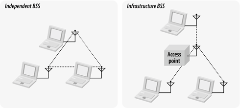
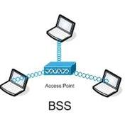
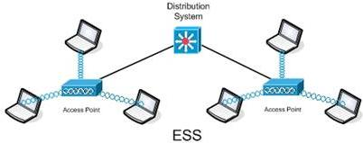
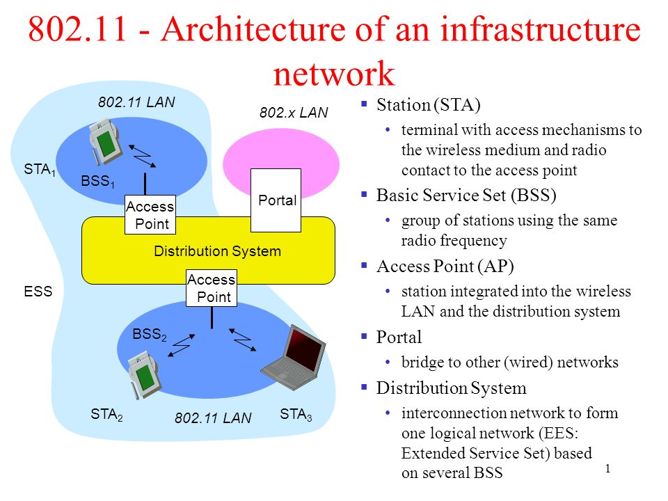

# Wireless LAN Mimarisi

Mimariyi anlamak için öncelikle mimariyi oluşturan bileşenleri tanımlayalım.

Not: Karıştırmamak için bileşenlerin orjinal ismini kullandım.Çünkü bazı terimlerin türkçe karşılıkları bulunmuyor :/

### Station (istasyon)

Station basitçe açıklamak gerekirse, kablosuz ortama bağlanan bileşendir.Yani sizin evinizdeki kablosuz ağınıza bağlanan telefonunuz, bir istasyondur.Station, adreslenebilir ve mantıksal bir bileşen olduğu için ille de fizisel bir bilgisayar olmak zorunda değildir.

### Basic Service Set (BSS)

BSS ise birbiriyle iletişim kuran istasyonlar kümesidir.Bir BSS, elektromanyetik yayılımın belirsizliklerinden dolayı genellikle belirli bir alanda geçerli değildir.

İki tür BSS vardır.Independent BSS ve Infrastructure BSS:

+ BSS'ye bağlı olan tüm istasyonlar mobil(taşınabilir) ise -*AP yoksa*- ve kablolu bir ağa bağlantı yoksa, o BSS, **independent BSS (IBSS)** olarak adlandırılır.IBSS, az sayıda istasyondan oluşan ve özel nedenlerle yaratılmış olan kısa ömürlü bir ağdır.
Ayrıca **ad-hoc ağ**  olarak da adlandırılır.(*'ad hoc' terimi ingilizcede belirli bir amaç için yapılmış anlamına gelir*)

+ Eğer BSS bir Access Point(AP) içeriyorsa o BSS'ye **infrastructure BSS(BSS)** denir.

Her BSS, eşsiz bir BSSID (*basic service set identifier*) değeri ile tanımlanır.Bu değer MAC adresidir ve 48 bittir.İlk 24 biti Access Point'in ağ kartını üretici firmayı belirtir.

*Independent BSS ve Infrastructure BSS Farkı*

*Basitçe bir BSS*

### Extended Service Set (ESS)

ESS, birbiriyle bağlantılı en az iki tane BSS'den oluşan ağ sistemidir.Örneğin bir apartmanda kurulu bir ağ sisteminde, her kattaki ağ birer BSS, binanın tamamı da -*eğer bağlıysa*- ESS olarak düşünülebilir.Bu BSS'ler birbirine Distribution System ile bağlanırlar.

Bu ağdaki BSS'lerin Infrastructure BSS -*AP içeren*- olduğuna dikkat edin.

*Basitçe bir ESS*

### Distribution System

Distribution System (*Dağıtım Sistemi*), bir ESS'deki Access Pointleri birbirine bağlar.Kablosuz da olabilir fakat genelde kablolu bağlantı olur.

*Basitçe bir infrastructure bss'in temel mimarisi*
