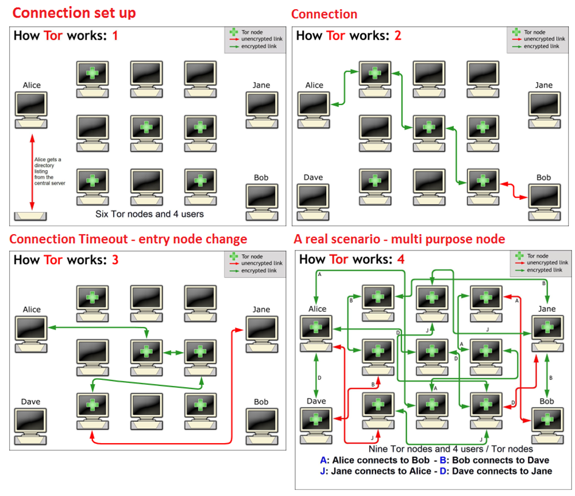

## Tor Ağı Nasıl Çalışır ?

Örneğin Muhammet ile Tülin'in birbirleri ile haberleşmek istediklerini varsayalım.
+ Muhammet öncelikle merkezi bir dizin sunucusuna şifrelenmemiş bağlantı yaparak Tor kullanan
node'ların listesini alır.
+ Bu liste temin edildikten sonra Tor, node listesinden rastgele bir node
seçer ve bu node ile şifrelenmiş bir bağlantı sağlar. Bu node'a **entry node** (*giriş noktası*) denir.
+ Daha sonra bağlantı sağlanan bu nokta, rastgele seçilen ikinci bir Tor node ile
şifrelenmiş bir bağlantı sağlayıp veriyi bir sonraki noktaya iletir. Bu işlem ta ki Tülin'e
bağlı **exit node** (*çıkış noktası*) kullanan istemciye kadar devam eder.
+ Tor ağı yönlendirmelerinde Tor uygulamaları bir sonraki node'u rastgele seçer ve kimliksiz
gezinmenin devam etmesi için tüm açılan oturumlar belli süre ile açılırlar. Ve tor, her bağlantı
için farklı bir yol seçer.

(*basitçe tor bağlantısını anlatan görsel*)

Bir diğer önemli nokta ise Muhammet kendi trafiği için bir başlangıç noktası iken diğer Tor trafiği için ise bir geçiş noktasıdır. Bu durum network trafik analizini zorlaştıran bir durumdur. Trafik incelenirken paketin Muhammet'ten mi çıktığı yoksa daha önceki bi node'dan mı geldiğini belli etmek zor bir işlemdir.
